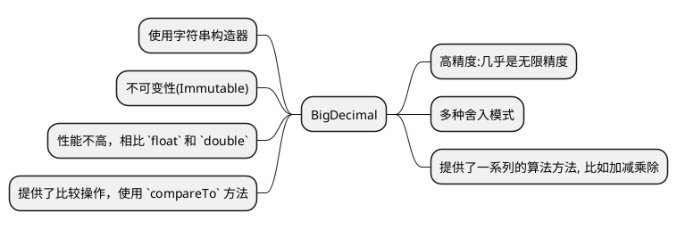

# BigDecimal

在 Java 的开发中，不可避免会遇到小数的计算。然而，小数的计算对于计算机而言，并不是一件简单的事情。经常会遇到精度丢失的问题。所以，本文将介绍另
一种方法，使用 BigDecimal。

## float 和 double {id="float-and-double"}

在 Java 中，提供了 `float` 和 `double` 两种小数类型。例如:
```Java
float rate = 97.85f;
double amount = 899.789;
```
以下是 `float` 与 `double` 两种数据类型之间的对比表格：

| 特性   | float(单精度浮点数)        | double(双精度浮点数)  |
|------|----------------------|-----------------|
| 精度   | 约 6-7 位有效数字          | 约 15-16 位有效数字   |
| 内存占用 | 4 字节（32 位）           | 8 字节（64 位）      |
| 取值范围 | 较小的数值范围              | 更大的数值范围         |
| 默认类型 | 需在数字后加 f 或 F         | 数字面量默认为 double  |
| 精度损失 | 较高的精度损失              | 相对较低的精度损失       |
| 性能考虑 | 在内存敏感场合更有效率          | 在许多现代处理器上运算速度更快 |
| 使用场景 | 需要减少内存占用时，如处理大量数据的数组 | 一般浮点运算，如科学和工程计算 |

所以，一般情况下，使用 `double` 类型即可。

## 精度丢失问题 {id="the-issue-of-precision-loss"}

`float` 和 `double` 这两种数据类型都是基于 IEEE754 标准的。这个标准定义了浮点数的格式、异常处理、
以及各种数学运算的规则，目的是在不同的计算机系统和编程语言之间提供一致和可靠的浮点运算。

但是，在使用 `float` 或者 `double` 的时候，会出现精度丢失的问题。如下示例:
```Java
double a = 0.1;
double b = 0.2;
double c = a + b;
// c = 0.30000000000000004
System.out.println("c = " + c);
```
直觉上，我们期望 c 的值是 `0.3`。然而，由于 `0.1` 和 `0.2` 在以二进制表示时并非完全精确，所以计算的结果可能会略有偏差。这种偏差通常非常小，
但在进行大量运算或需要非常精确的计算时，这些偏差可能会累积起来，导致明显的误差。

在这个例子中，将 `0.1` 和 `0.2`（使用 double 类型）相加的结果是 `0.30000000000000004` 而不是精确的 0.3。精度损失为大约
`5.551115123125783e-17`。

## 使用 Long 类型来代替小数 {id="calc-with-long"}

在实际开发中，我们可能会使用 `Long` 类型来替代。比如价格，存储使用“分”作为单位，`56.78` 存储为 `5678`, 展示的时候在除 100。

但是这种做法，也会产生精度丢失的问题，比如 `100 / 3` 得到的结果就是 `33`。所以，最佳的做法还是使用 `BigDecimal` 作为小数类型。

## 使用 BigDecimal {id="BigDecimal"}

在 Java 1.1 版本中引入了 `BigDecimal`, 为高精度计算提供支持。其特点如下:



加减乘除的示例如下:
```Java
BigDecimal a = new BigDecimal("10.5");
BigDecimal b = new BigDecimal("3.5");

BigDecimal sum = a.add(b);        // 加法
BigDecimal difference = a.subtract(b); // 减法
BigDecimal product = a.multiply(b);    // 乘法
// 除法，结果四舍五入到小数点后两位
BigDecimal quotient = a.divide(b, 2, RoundingMode.HALF_UP);
```
其舍入模式，如下表所示:

| 舍入模式        | 描述                                                    |
|-------------|-------------------------------------------------------|
| UP          | 远离零方向舍入                                               |
| DOWN        | 靠近零方向舍入                                               |
| CEILING     | 向正无穷方向舍入                                              |
| FLOOR       | 向负无穷方向舍入                                              |
| HALF_UP     | 四舍五入（若舍弃部分>=0.5，则舍入行为与UP相同）                           |
| HALF_DOWN   | 五舍六入（若舍弃部分>0.5，则舍入行为与UP相同）                            |
| HALF_EVEN   | 若舍弃部分左边的数字为奇数，则舍入行为与HALF_UP相同；如果为偶数，则舍入行为与HALF_DOWN相同 |
| UNNECESSARY | 不需要舍入，若用于无法精确表示的数值，则会抛出异常                             |

这些舍入模式在 `BigDecimal` 的运算中非常重要，特别是在进行除法或设置小数位数时，选择合适的舍入模式可以确保结果符合预期。

## 银行家算法 {id="the-banker-algorithm"}

在 BigDecimal 的舍入模式中，`HALF_EVEN` 模式采用了银行家算法，其规则如下:

* 如果需要舍弃的数字小于 5，就向下舍入；
* 如果大于 5，就向上舍入；如果正好是 5，则向最接近的偶数方向舍入;
* 如果舍弃部分左边的数字是奇数，则舍入行为与 HALF_UP（四舍五入）相同；
* 如果左边的数字是偶数，则舍入行为与 HALF_DOWN（五舍六入）相同。

这种舍入方式在统计学和财务计算中很常见，因为它减少了累积的舍入误差，对于大量的四舍五入运算来说，结果会更加中性和公平。

## 一些常见的错误 {id="errors"}

下面介绍一些比较常见的错误，在实际开发中要避免这些问题。

1. **直接使用浮点数构造器**：直接使用 `double` 构造 `BigDecimal` 实例是一个常见错误。这种做法会先将 `double` 类型的值转换为字符串，然后再转换为 `BigDecimal`，这可能会导致不可预期的精度问题。
   ```java
   BigDecimal incorrect = new BigDecimal(0.1); // 错误的做法
   BigDecimal correct = new BigDecimal("0.1"); // 正确的做法
   ```

2. **不使用舍入模式进行除法**：在使用 `BigDecimal` 进行除法运算时，如果不指定舍入模式，且无法精确除尽，会抛出 `ArithmeticException` 异常。
   ```java
   BigDecimal a = new BigDecimal("1");
   BigDecimal b = new BigDecimal("3");
   // BigDecimal result = a.divide(b); // 抛出异常
   BigDecimal result = a.divide(b, 2, RoundingMode.HALF_UP); // 正确的做法
   ```

3. **比较 `BigDecimal` 时使用 `equals()` 而不是 `compareTo()`**：`BigDecimal` 的 `equals()` 方法不仅比较值，还比较它们的比例。因此，两个值相同但比例不同的 `BigDecimal` 实例将被认为是不相等的。
   ```java
   BigDecimal x = new BigDecimal("2.00");
   BigDecimal y = new BigDecimal("2.0");
   // x.equals(y) // 返回 false
   x.compareTo(y) == 0 // 返回 true
   ```

4. **未考虑到 `BigDecimal` 的不可变性**：`BigDecimal` 是不可变的，这意味着所有的运算都不会改变原始对象，而是返回一个新的对象。
   ```java
   BigDecimal amount = new BigDecimal("10");
   amount.add(new BigDecimal("5")); // 这不会改变 amount 的值
   amount = amount.add(new BigDecimal("5")); // 正确的做法
   ```

5. **在循环中频繁创建 `BigDecimal` 对象**：由于 `BigDecimal` 对象的创建和运算成本相对较高，应避免在循环或频繁调用的方法中创建大量 `BigDecimal` 对象。

6. **错误的初始值**：使用类似 `BigDecimal.ZERO`, `BigDecimal.ONE`, 或 `BigDecimal.TEN` 作为初始值时，要确保它们的使用场景适合。

最后，还有一个例子，是我在实际工作中遇到的。计算金额达成的百分比，预期是 99.61 实际是 1。
```Java
BigDecimal currentValue = BigDecimal.valueOf(1793.00);
BigDecimal targetValue = BigDecimal.valueOf(1800);
BigDecimal result = currentValue.divide(targetValue, 2, RoundingMode.HALF_DOWN);
System.out.println("result = " + result);
```

## 总结 {id="summary"}

这篇文章详细讨论了在 Java 开发中处理小数和精度问题的不同方法。首先介绍了 Java 中的两种基本小数类型：`float`（单精度浮点数）和 `double`（双精度浮点数），并比较了它们的精度、内存占用、取值范围、默认类型、精度损失和性能考虑等特点。文章指出，在许多情况下，`double` 类型是一个更好的选择，因为它提供了更高的精度和更广泛的数值范围。

然后，文章转向讨论 `float` 和 `double` 类型的一个主要问题：精度损失。由于这些类型是基于 IEEE 754 标准，它们在处理特定的浮点数时会出现精度丢失的问题。为了解决这个问题，文章建议使用 `BigDecimal` 类，这是在 Java 1.1 版本中引入的，用于提供高精度计算。`BigDecimal` 支持几乎无限的精度，提供多种舍入模式，并包括一系列的算法方法，如加减乘除，但它的性能相对于 `float` 和 `double` 较低。

文章还介绍了 `BigDecimal` 的使用方法，包括其构造器和运算操作。特别指出了 `BigDecimal` 的多种舍入模式，这些在进行精确计算时非常重要。最后，文章讨论了 `HALF_EVEN` 舍入模式，也称为银行家算法，它在统计学和财务计算中常用，以减少累积的舍入误差，提供更公平的结果。