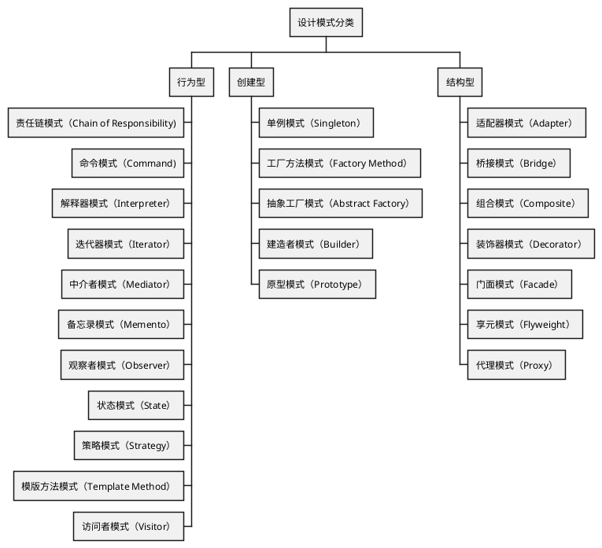

# 面向对象

在当今的软件开发领域，面向对象编程（Object-Oriented Programming, OOP）作为一种主流且深入人心的编程范式，其核心理念已深深地植根于众多现代
编程语言的设计与实践中，包括Java、C#、Python等。面向对象编程以“对象”为核心，通过封装、继承和多态三大特性构建出高度模块化、易于复用和扩展的系
统结构。

## 设计模式 {id="design-patterns"}

设计模式，作为一种久经验证的最佳实践和经验总结，在软件工程领域扮演着至关重要的角色。它并非具体的代码片段或库，而是一种在面向对象软件设计中解决常
见问题的通用可复用方案。设计模式是历经众多项目迭代与实践锤炼后形成的策略描述，用来指导开发者如何在特定上下文中恰当地组织代码结构、定义类间关系以
及管理对象交互。

设计模式分为创建型（Creational Patterns）、结构型（Structural Patterns）、行为型（Behavioral Patterns）三类，如下图所示:

