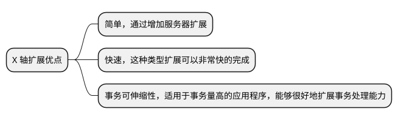
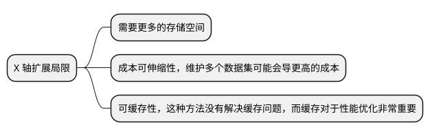

# AKF 扩展立方体

AKF扩展立方体（AKF Scaling Cube）是一个用来帮助理解和规划软件及系统架构扩展性的模型。AKF代表 Agilisaurus, Kleiner, Fisher，这个模型由来自eBay和PayPal的技术领袖创造，并在他们的咨询实践中使用。扩展立方体提供了一个三维视角来考虑如何通过多种维度来扩展应用程序和服务。

## X 轴 {id="x-axis"}

这张图就展示了 AKF 扩展立方体，从 X、Y、Z 轴三个方向来思考应用的可扩展性。其中 X 轴指的是通过复制（Replicate）和负载均衡（LB）来提升应用的可扩展性。

我们可以通过将应用层的用户状态保存到客户端的缓存中，或者集中式存储（比如 Redis），使得应用层保持无状态。从而，我们可以不断复制应用实例，通过负载均衡将请求转发到不同的应用实例，提升应用层可横向扩展。

而数据层，可以通过读写复制、分离来提升数据库层的可扩展性。比如将部分搜索的日志通过 CDC 等方式同步到 ES、MongoDB 等非关系型数据库中。而非关系型数据库具有很好的横线扩展能力。

通过 X 轴扩展的优点如下:

其中事务伸缩性（Transaction Scalability）指的是系统能够处理的事务的数量会随着资源（CPU、内存、存储、网络）的增加而增加，这里不要理解成是数据库中的那种事务。

通过 X 轴扩展也存在局限性：

其中，可缓存性指的是随着应用服务器的增加，虽然可以处理更多的请求，但是并没有直接解决缓存的问题。虽然不同应用示例可以通过集中式的缓存来共享数据，但是存在缓存同步、网络延迟、缓存热点、扩展限制、复杂性增加等问题。

## 参考资料 {id="reference"}

1. [The Scale Cube](https://akfpartners.com/growth-blog/scale-cube)