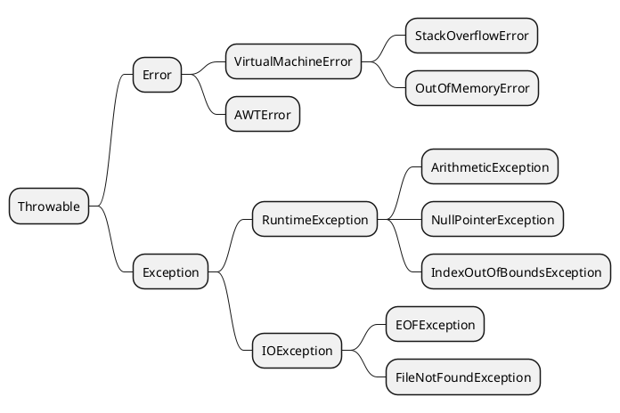
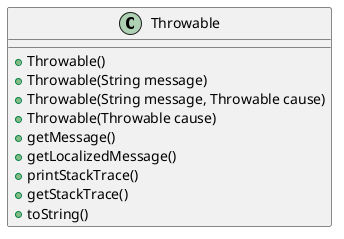

# Exceptions

在 Java 中，所有的异常都继承于 Throwable 类，下面又分为 Error 和 Exception 。



## Error 和 Exception 的区分 {id="difference-between-error-and-exception"}

这两者之间的区别如下:

* Error: 严格来说应该称之为错误，而不是异常。通常是在操作系统或者 JVM 层面发生的错误，不能够恢复，一般在程序中不需要特别关心。
* Exception: 程序发生的异常，所有的异常都需要开发者进行相应的处理。

对于 Exception 而言，又分为两种类型，分别是 `CheckedException` 和 `UncheckedException`。前者继承 `Exception` 类，后者继承`RuntimeException` 类。前者是需要开发者必须要处理或者在方法声明中向上 throw 的。而后者并不强制要求处理。

从编译角度来说，到底选择 `CheckedException` 还是 `UncheckedException` 是要根据实际情况而定：你这个异常是否需要在编译阶段进行检查。一般来说，在 Spring 这样拥有全局异常处理机制的框架中，我们可以使用`UncheckException`。

从是否是 Bug 的角度来说，比如说某个文件找不到这是一个 Bug，我们是可以修复的，只要指定一个正确的文件路径就可以了。这时候我们就应该采用 CheckedException 。但是有些异常是我们无能为力解决的，比如说用户输入了一个错误的值导致在数据库中查找不到相应的记录。这也是我们预料不到的事情，这时候我们就应该使用`UncheckedException` 。

## Throwable 中的重要方法 {id="throwable-methods"}



`Exception` 类集成 `Throwable` 类，而 `Throwable` 中的重要方法如上图所示。需要说明的是 `getLocalizedMessage()` 提供了本地化 Message 的一种机制。当应用程序需要提供多语言支持的时候，可以通过重写这个方法来实现。

`toString()` 方法默认返回“类名 + message” 返回，一般用于日志记录:

```Java
public String toString() {
    String s = getClass().getName();
    String message = getLocalizedMessage();
    return (message != null) ? (s + ": " + message) : s;
}
```

`printStackTrace()` 用于输出异常栈，记录了异常发生的上下文信息：

```Java
private void printStackTrace(PrintStreamOrWriter s) {
    Object lock = s.lock();
    if (lock instanceof InternalLock locker) {
        locker.lock();
        try {
           lockedPrintStackTrace(s);
        } finally {
           locker.unlock();
       }
    } else synchronized (lock) {
        lockedPrintStackTrace(s);
    }
} 
```