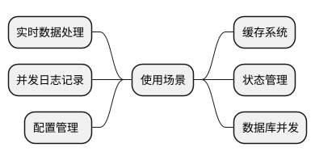

# 读写锁原理解析

Go 语言以其简洁高效的并发模型而著称，其中一个重要组件就是其内建的读写锁（Read-Write Locks），即 sync.RWMutex 结构体。读写锁作为 Go 语言
标准库 sync 包的一部分，旨在提供一种机制，在多线程或协程环境下既能支持高并发读操作，又能保证数据完整性，同时限制写操作的互斥性。

## 为什么需要读写锁

前文我们已经描述了互斥锁(Mutex)，那为什么还需要读写锁。互斥锁是为了避免在并发写入的时候因为不是原子操作从而导致结果错误，而读操作是否需要锁呢？答案是需要的，在读数据的时候，我们希望不要写入新数据，这样就会导致数据不一致。
```go
type Product struct {
	m       sync.Mutex
	stock   int32
	soldNum int32
}
func (p *Product) show() {
	fmt.Println(p.stock)
	fmt.Println(p.soldNum)
}
```
有一个产品，其有一个 `show` 的方法，打印库存以及售卖数量。假设库存初始是 1000，那么售卖数量就是 1000 减去 `stock`。在并发读写的时候，执行了第 7 行，读出库存是 500，当第 8 行还没有执行的时候，又售卖出去一个，这时候执行第 8 行，打印的 `soldNum` 就是 499。也就是说 `p.stock` 和 `p.soldNum` 打印出来是不一样的。

所以我们希望这两个值打印出来是同一时刻的数值。这是我们可以给打印操作加上互斥锁可以解决这个问题。但是如果每次读都加锁的话，性能就会出现问题。所以，我们希望可以并发读，但是不能并发写。如果存在协程在读的时候，那么写的协程需要暂停。这时候就需要读写锁了。上面的代码修改如下:
```go
type Product struct {
	m       sync.RWMutex		// 读写锁
	stock   int32
	soldNum int32
}
func (p *Product) show() {
	p.m.RLocker()			// 如果只是读，则加上读锁
	defer p.m.RUnlock()
	fmt.Println(p.stock)
	fmt.Println(p.soldNum)
}
```

## 读写锁的实现
读写锁一般是这样实现的：有一把读锁以及一把写锁，两个锁各自有一个队列。当读锁队列中存在协程的时候，写锁是不能获取成功的。所以写锁要获取成功有两个条件，一个是读锁队列为空，另一个是和其他协程竞争写锁成功。

写锁是共享锁，也就说如果有多个协程获取写锁，是可以同时获取成功的，这也就是并发读。但是写锁是互斥锁，同一时间只能有一个协程获取写锁。

另外，如果写锁已经加锁成功，那么读锁也是获取不成功的。协程需要进入读锁的队列等待。

上面说的是一般读写锁的实现，接下来我们来看看 Go 语言中的读写锁的具体实现。


`RWMutex` 是一个结构体，有 5 个字段，解释如下:

- `w`: 这是一个互斥锁，注释中说它是一个 `pending writers`，意思是说准备写入的协程所持有
- `writerSem`: 写锁的 Sema 锁，定义同时可以有多少个协程并发执行，是一个平衡二叉树的结构，用于排队
- `readerSem`: 这是写的 Sema 锁
- `readerCount`: 这个是要加上读锁的协程的数量，如果正数表示正在读的协程，如果负数则表示加了写锁
- `readerWait`: 写锁在生效之前，需要等待多少个读锁释放

下面我们来说说加写锁的逻辑:


然后我们来看解写锁的逻辑:

- 将 `readerCount` 变为正值，允许读锁的获取
- 释放在 `readerSem` 中等待的读协程
- 解锁 `mutex`

源码逻辑如下:


接着我们来看看加读锁的逻辑:

- `readerCount` 加上 1
- 如果`readerCount` 是正数，则表示没有竞争写锁的协程，这时候如果有协程要加读锁，只需要递增即可
- 如果`readerCount`是负数，则表示已经有协程加上了互斥锁，那就需要将 `readerCount` 变成改成 ，指的是有新协程想要加读锁，然后将这个协程加入 `readerSem`中排队，等到写锁释放后，在从读队列中释放这些等待的协程

最后我们来看看解读锁的逻辑：

- `readerCount` 减去 1
- 如果 `readerCount` 是正数，解锁成功
- 如果 `readerCount` 是负数，说明写锁在排队
    - 判断要解开的这个协程是不是最后一个，如果是则唤醒写协程

## 读写锁的使用场景

读写锁适合读多写少的场景，可以减少锁冲突。如果写多读少，则使用读写锁的意义并不大，因为大部分情况都是要加互斥锁的。



> 另外需要注意，锁的持有时间不能太长。尤其是写锁，因为它会阻塞所有的读操作和写操作。

## 锁异常的排查

上面说的是锁的正确打开方式，接下来说说错误的打开方式：

### 锁拷贝

锁拷贝，使用多个锁的时候要创建新的锁，而不是拷贝一个锁，拷贝会导致其状态以及 sema 队列一并拷贝，有可能导致死锁。有时候，锁隐藏在一个结构体中，那么拷贝这个结构体也是有问题的。
```go
mu := sync.Mutex{}
mu.Lock()
println("To do somethings")
muCopy := mu		// 拷贝锁
println("To do somethings")
mu.Unlock()
muCopy.Unlock()
time.Sleep(time.Second)
```
这种情况，我们可以使用 GO 自带的工具来检测:
```shell
$ go vet main.go
# command-line-arguments
.\main.go:12:12: assignment copies lock value to muCopy: sync.Mutex
```
死锁的检测可以使用一个 Gihub 上的一个工具 [go-deadlock](https://github.com/sasha-s/go-deadlock)。

### RACE 竞争检测

我们来看一段问题代码，代码中的 `num` 递增，但是在并发下结果肯定是不对的:
```go
func doIncr(num *int) {
	*num++
}
func main() {
	num := 0
	for i := 0; i < 1000; i++ {
		go doIncr(&num)
	}
	time.Sleep(time.Second)
	fmt.Println(num)		// 结果不到 1000
}
```
这种情况我们通过 Go 的命令行能够检测出来:
```shell
> go build --race main.go
> main    # 运行编译后的可执行文件，在 Windows 下是 main.exe
==================                    
WARNING: DATA RACE                    
Read at 0x00c0000160d8 by goroutine 8:
  main.doIncr()                       
      C:/Users/happy/GolandProjects/hello/src/main.go:9 +0x30
  main.main.func1()
      C:/Users/happy/GolandProjects/hello/src/main.go:15 +0x39
```
然后就会显示警告`DATA RACE`, 这总情况下说明存在数据竞争，就需要加锁。

## 总结 {id="summary"}

本文深入探讨了 Go 语言中的读写锁（`sync.RWMutex`）原理及其在并发编程中的重要应用。Go 的读写锁设计旨在解决高并发场景下共享资源的访问问题，它
允许多个协程同时进行读操作以提升性能，但确保同一时间只有一个协程执行写操作以维护数据完整性。

文章通过实例展示了为什么在并发环境下不仅写操作需要互斥锁保护，读操作同样需要避免因数据不一致引发的问题，并进一步引入读写锁的概念和使用方式。Go
中的 `sync.RWMutex` 结构体提供了读锁和写锁机制，其中读锁支持并发读取，而写锁则确保互斥写入，并且在有读取协程时，写入协程必须等待。

文中详细分析了 `sync.RWMutex` 结构体内部字段及其实现逻辑，包括如何通过 `w`、`writerSem` 和 `readerSem` 等字段控制读写协程的排队与唤醒，
以及读锁与写锁的加锁、解锁过程。此外，还介绍了读写锁适用于读多写少场景的特点，并强调了正确使用锁的重要性，举例说明了锁拷贝导致死锁等常见错误以及如何利用 Go 自带工具如 `go vet` 和 race detector 进行锁异常排查和竞态条件检测。