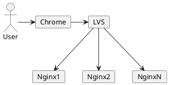
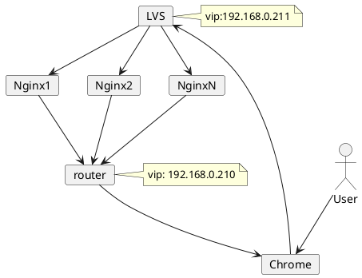

# LVS

在要求高性能的场景，只是用 Nginx 七层负载是不够的，因此我们引入了 LVS 四层负载均衡器，它的负载性能是 Nginx 的几十倍，所以，LVS 可以充当 Nginx 集群的调度者。另外，Nginx 需要处理请求以及响应。而 LVS 只调度请求，不处理响应。这篇文档详细描述了 LVS 结合 Nginx 的应用。

## 什么是 LVS {id="what-is-lvs"}

LVS （Linux Virtual Server），是一个提供四层负载均衡的负载均衡调度器，高性能、高伸缩、高可用。它是由章文嵩博士主导的开源的负载均衡项目。这个 LVS （ipvs) 已经被集成到了 Linux 内核中。其有着非常高的性能。


LVS 网络拓扑如下:



## LVS 的三种模式 {id="three-mode"}

第一种模式是 NAT 模式，这种模式和 Nginx 负载均衡类似，会处理 Nginx 返回的请求响应。所以如果对性能要求很高，那么这种模式是不合适的。

第二种模式是 TUN，这是 IP 隧道的模式，这种模式下，会将请求响应由 Nginx 直接返回给客户端，而不会经过 LVS，这样 LVS 的压力就降低了。每一个节点都需要配备网卡，并且 nginx 集群是暴露在公网的。

第三种模式是 DR，如下图所示，响应通过拥有虚拟IP的路由返回，避免了 nginx 集群暴露在公网。



## LVS 支持的负载均衡算法 {id="load-balancing-algorithms"}

LVS 支持两类负载均衡算法，分别为静态算法和动态算法。

### 静态算法 {id="static"}

静态：根据LVS本身自由的固定的算法分发用户请求。

- 轮询（Round Robin 简写’rr’）：轮询算法假设所有的服务器处理请求的能力都一样的，调度器会把所有的请求平均分配给每个真实服务器。

- 加权轮询（Weight Round Robin 简写’wrr’）：安装权重比例分配用户请求。权重越高，被分配到处理的请求越多。（同Nginx的权重）

- 加权轮询（Weight Round Robin 简写’wrr’）：安装权重比例分配用户请求。权重越高，被分配到处理的请求越多。（同Nginx的权重）

- 目标地址散列（Destination Hash 简写’dh’）：根据url的不同，请求到不同的RS。（同Nginx的url_hash）

### 动态算法 {id="dynamic"}

动态：会根据流量的不同，或者服务器的压力不同来分配用户请求，这是动态计算的。

- 最小连接数（Least Connections 简写’lc’）：把新的连接请求分配到当前连接数最小的服务器。

- 加权最少连接数（Weight Least Connections 简写’wlc’）：服务器的处理性能用数值来代表，权重越大处理的请求越多。Real Server 有可能会存在性能上的差异，wlc动态获取不同服务器的负载状况，把请求分发到性能好并且比较空闲的服务器。

- 最短期望延迟（Shortest Expected Delay 简写’sed’）：特殊的wlc算法。举例阐述，假设有ABC三台服务器，权重分别为1、2、3 。如果使用wlc算法的话，当一个新请求进来，它可能会分给ABC中的任意一个。

- 最少队列调度（Never Queue 简写’nq’）：永不使用队列。如果有Real Server的连接数等于0，则直接把这个请求分配过去，不需要在排队等待运算了（sed运算）。

## LVS 节点配置 DR 模式 {id="dr"}

因为我使用的是虚拟机，所以在开展实验之前，我们需要先将 Linux 中的 NetworkManager 服务关闭:

```shell
$ systemctl stop NetworkManager
$ systemctl disable NetworkManager
```
> 包括我们的 nginx 服务器上都需要操作这一步骤。

接着我们来配置一个虚拟IP，将网卡的配置文件复制出一份来，创建子接口：
```shell
cp /etc/sysconfig/network-scripts/ifcfg-enp0s3 \
	/etc/sysconfig/network-scripts/ifcfg-enp0s3:1
```
然后修改复制出来的网卡内容，将虚拟 IP 配置成`192.168.0.212`, 如下:
```shell
BOOTPROTO="static"
DEVICE="enp0s3:1"
ONBOOT="yes"
IPADDR=192.168.0.212
NETMASK=255.255.255.0
```
接着安装 ipvs 的管理工具 `ipvsadm`, 而 ipvs 是 LVS 的核心，目前已经集成到了 Linux 的内核中:
```shell
$ yum install ipvsadm -y
$ ipvsadm -Ln  # 验证是否安装成功
IP Virtual Server version 1.2.1 (size=4096)
Prot LocalAddress:Port Scheduler Flags
  -> RemoteAddress:Port           Forward Weight ActiveConn InActConn
```

## Nginx 节点配置 {id="nginx-node-configure"}

接着我们需要在 Nginx 节点进行配置，第一步是创建一个专门用于响应的网卡子接口:
```shell
$ cd /etc/sysconfig/network-scripts/
$ cp ifcfg-lo ifcfg-lo:1
```
修改这个复制出来的文件的内容如下:
```shell
DEVICE=lo:1  # 重命名，加上 :1
IPADDR=192.168.0.212  # 虚拟IP
NETMASK=255.255.255.255 # 全部都是 255
NETWORK=127.0.0.0
# If you're having problems with gated making 127.0.0.0/8 a martian,
# you can change this to something else (255.255.255.255, for example)
BROADCAST=127.255.255.255
ONBOOT=yes
NAME=loopback
```
接着，另一台 Nginx 主机也相同操作。

## Nginx 节点配置 ARP {id="arp"}

首先我们要设置 `arp-ignore`, 这是 ARP 的响应级别，规定了哪些 IP 可以响应请求，有两个选项:

- 0：只要本机配置了 ip, 就能响应请求
- 1：请求的目标地址到达对应的网络接口，才会响应请求

接着我们要配置第二项: `arp-announce`, 这是 ARP 的通告行为，指的是返回响应，有三个选项:

- 0：本机上任何网络接口都可以向外通告，所有的网卡都能接受通告
- 1：尽可能避免本王卡与不匹配的目标进行通告
- 2：只在本网卡通告

上面的两项配置通过编辑 `/etc/sysctl.conf` 文件实现，在末尾追加如下配置:
```shell
net.ipv4.conf.all.arp_ignore = 1
net.ipv4.conf.default.arp_ignore = 1
net.ipv4.conf.lo.arp_ignore = 1
net.ipv4.conf.all.arp_announce = 2
net.ipv4.conf.default.arp_announce = 2
net.ipv4.conf.lo.arp_announce = 2
```
刷新配置, 使用 `sysctl -p`。接着添加 host 路由，命令如下:
```shell
# 如果不存在 route 命令，则 yum install net-tools -y
$ route add -host 192.168.0.212 dev lo:1
# 通过 route -n 命令查看是否列表中出现我们添加的虚拟 IP
$ route -n
Kernel IP routing table
Destination     Gateway         Genmask         Flags Metric Ref    Use Iface
0.0.0.0         192.168.0.1     0.0.0.0         UG    100    0        0 enp0s3
192.168.0.0     0.0.0.0         255.255.255.0   U     100    0        0 enp0s3
192.168.0.212   0.0.0.0         255.255.255.255 UH    0      0        0 lo
```
但是需要注意的是，如果我们重启之后，这配置就不存在了。如果希望配置永久生效，可以使用如下方式:
```shell
echo "route add -host 192.168.0.212 dev lo:1" >> /etc/rc.local
```

## 配置集群规则 {id="rules"}

接着，我们在 LVS 节点上配置集群规则。首先创建一个集群，其中 `rr`指的是采用轮询算法：

```shell
$ ipvsadm -A -t 192.168.0.212:80 -s rr -p 5
# 查看集群列表
$ ipvsadm -Ln
IP Virtual Server version 1.2.1 (size=4096)
Prot LocalAddress:Port Scheduler Flags
  -> RemoteAddress:Port           Forward Weight ActiveConn InActConn
TCP  192.168.0.212:80 rr
```
接着将两个 Nginx 节点添加到集群中去:
```shell
$ ipvsadm -a -t 192.168.0.212:80 -r 192.168.0.115:80 -g
$ ipvsadm -a -t 192.168.0.212:80 -r 192.168.0.120:80 -g
# 查看是否两个节点是否已经添加到集群
$ ipvsadm -Ln
IP Virtual Server version 1.2.1 (size=4096)
Prot LocalAddress:Port Scheduler Flags
  -> RemoteAddress:Port           Forward Weight ActiveConn InActConn
TCP  192.168.0.212:80 rr
  -> 192.168.0.115:80             Route   1      0          0         
  -> 192.168.0.120:80             Route   1      0          0
```
然后使用下面的命令，让配置生效:
```shell
$ ipvsadm -S
$ ipvsadm -Ln --stats
IP Virtual Server version 1.2.1 (size=4096)
Prot LocalAddress:Port               Conns   InPkts  OutPkts  InBytes OutBytes
  -> RemoteAddress:Port
TCP  192.168.0.212:80                    2       36        0     9014        0
  -> 192.168.0.115:80                    1       30        0     8654        0
  -> 192.168.0.120:80                    1        6        0      360        0
```
如果发现没有轮询的话，是触发了持久化配置，是正常的。

## Keepalived + LVS 实现高可用 {id="keepalived-lvs"}

上面的模式还是存在一个问题，就是 LVS 是单节点，可能会出现单节点故障，所以可以利用 Keepalived 实现 LVS 主备高可用。使用 Keepalived 还可以实现健康检查，这是目前很多公司的采用的高可用的方案。