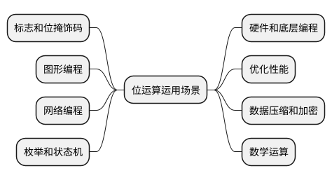

# 运算符

计算机也好，程序也好，其实只做一件事，那就是运算。运算就需要使用运算符，比如说加减程序。这一篇文档就来描述 C 语言中的一些常用的运算符。


## 赋值表达式 {id="assignment-expression"}

赋值运算符使用 `=`，示例如下:
```c
int first = 1;
int second;
// 从右往左运算
int third = second = first;
printf("%d, %d, %d\n", first, second, third);	// Output: 1, 1, 1
```

## 加减乘除取余运算 {id="arithmetic-operators"}

这五种运算是在编程中运用最多的就是这五种运算, 示例如下:
```c
int left = 2, right = 3;
int sum = left + right;     // 5
int diff = left - right;    // -1
int product = left * right; // 6
int quotient = left / right;    // 0, 因为整数和整数的商也是整数，所以取整
int remainder = left % right;   // 2
```

## 关系运算 {id="relational-operators"}

关系运算符有与(&&)、或(||)、非(!)。需要注意的是，在 C 语言中，1 表示是真、0 表示假。到了 C99 标准中，才给出了 `true`和 `false`的字面量的定义, 下面这两行定义取自头文件 `<stdbool.h>`:
```c
#define true	1
#define false	0
```

C  语言中的关系运算符有 `>`、 `<`、 `>=`、 `<=`、 `==`、 `!=`。有的人可能奇怪，为什么相等的关系运算符使用 `==`而不是 `=`。因为 `=`已经被作为了赋值运算符。那么为什么赋值运算符使用 `=`而相等的关系运算符使用 `==`呢？因为 C 语言的设计者认为赋值运算比关系运算要管得多，所以这样的安排可以少些一个 `=`。
```c
printf("3 > 2: %d\n", 3 > 2);   // Output: 1
printf("3 == 2: %d\n", 3 == 2);   // Output: 0
```
再复杂一些的表达式, 演示与或非:
```c
printf("3 == 2 && 5 < 3: %d\n", 3 == 2 && 5 < 3);   // Output: 0
printf("3 == 2 || 5 < 3: %d\n", 3 == 2 || 5 > 3);   // Output: 1
printf("!(1) %d !(0) %d\n", !1, !0);   // Output: 1 0
```

## 自增运算 {id="increment-operator"}

自增运算符可以使用 `++`或者 `--`, 示例如下:
```c
int i = 0;
printf("%d\n", i++);		// Output: 0, 因为是后加
int j = 0;
printf("%d\n", ++j);		// Output: 1, 因为是先加
```
如果是使用 `--`亦是如此，只不过一个是自增、一个是自减。

## 位运算 {id="bit-operator"}

什么是位？1 个字节由 8 个二进制位组成，最左边的位成为最高位，最右边的位成为最低位，每个二进制位的值只能是 0 或者 1。


位运算符有 `&、|、^、~`这四个，如下表所示:

| 位运算符   | 名称   | 含义                           |
|--------|------|------------------------------|
| &      | 按位与  | 相同为1不同为0                     |
| &#124; | 按位或  | 只要有一个为1，则为1，否则为0             |
| ^      | 按位异或 | 不同为1，相同为0                    |
| ~      | 取反   | 1得0， 0得1                     |
| <<     | 左移   | 将一个数的二进制位左移若干位，右侧补0，每位相当于乘 2 |
| >>     | 右移   | 将一个数的二进制位右移若干位，左侧补0，每位相当于除 2 |


位运算我们一般用来作为程序中得开关，举例说明: 在 Linux 的文件系统中，存在三种权限，分别是可读、可写、可执行，那么一共有 8 个开关状态，我们使用
三位 2 进制就可以表示了。

首先我们使用十六进制来表示这三种权限：可读(0x0), 可写(0x1), 可执行(0x2)。然后我们来举例说明如何设置开关，以及如何判断是否具有指定的权限:
```c
#include <stdio.h>

int isWrite(int flag) {
    return (0x1 & flag) == 0x1;
}
int main() {
    // 可读可写可执行
    printf("%d\n", isWrite(0x0 | 0x1 | 0x2));   // 1
    // 可读可执行
    printf("%d\n", isWrite(0x0 | 0x2));   // 0
    // 可执行
    printf("%d\n", isWrite(0x2));   // 0
    return 0;
}
```
除此之外，位运算的其他运用场景如下:


## 总结 {id="summary"}

这篇文章介绍了C语言中常用的一些运算符, 包括赋值表达式、算数运算符、关系运算、自增运算、位运算。