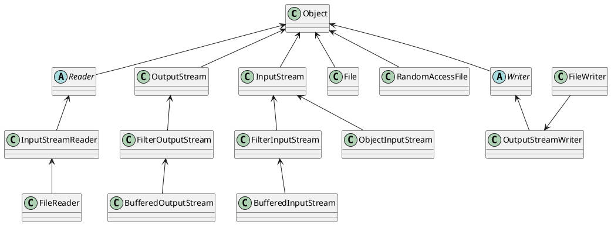
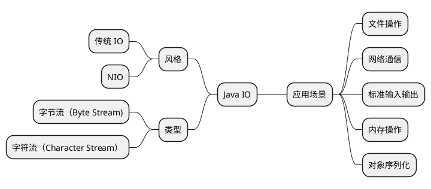
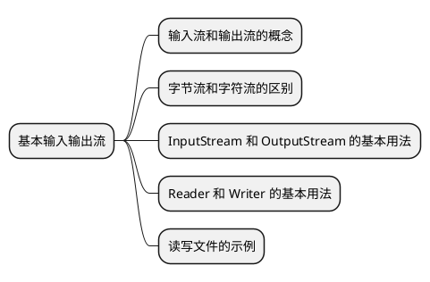

# Stream IO

当涉及到处理数据输入和输出时，Java IO（Input/Output）是每个Java程序员必须熟悉的关键概念之一。无论是读取文件、处理网络数据，还是与外部设备进
行通信，Java IO提供了丰富的工具和类库，使这些任务变得更加容易。

## 什么是 Java IO {id="what"}

如上文中的 UML 图示，Java IO（Input/Output) 是处理磁盘、网络、内存数据输入输出的机制和类库。其作用如下:

## 基本输入输出流 {id="basic-io-streams"}

无论是从文件中读取数据还是将数据写入到不同的目标，我们都应该先了解基本的 IO 流。这一小节中，我们将讲解如下内容:

### 输入流和输出流的概念 {id="input-stream-and-output-stream"}

我们先来说，什么是流。在 Java 中，我们经常将输入输出流和 Lamdba 中的流混为一谈，其实它们是两个完全不同的术语。Lamdba 中的 Stream 指的是处理
集合和数据流的操作，比如 `map`、`filter`、`reduce`，是函数式编程的一部分，通常用来对 `List` 、`Set`、`Map` 等集合进行操作。

而我们接下去要说的 Streams，指的是对文件、网络、内存中的数据，从一端流向另一端。