# TeamCity

这篇文档描述了 TeamCity 这款 CI/CD 工具的基本使用。

## 核心概念 {id="key-concepts"}

接下来介绍当中的一些核心概念，了解这些概念之后，才能更好的理解、应用 TeamCity。

* Build Agent: 类似于 Gitlab Runner，它是执行 Job 的单元，部署在项目所在服务上的。有多个 Build Agent 可以并行执行多个任务。

其架构如下:

```plantuml
@startuml
card server
card buildAgent1
card buildAgent2

server -right-> buildAgent1 
server -left-> buildAgent2 
@enduml
```



## 服务端部署 {id="deploy-server"}

这里使用 Docker 进行部署:
```Shell
docker run --name teamcity-server-instance \
    -v datadir:/data/teamcity_server/datadir \
    -v logs:/opt/teamcity/logs 
    -p 80:8111 jetbrains/teamcity-server
```
启动成功之后，访问 `http://domain` 出现如下界面:


选择数据存储的目录，然后点击 `Proceed` 进行下一步，选择数据库即可、同意使用协议即可完成初始化。

之后需要创建管理员账号:


接着就进入了主界面，如下:

