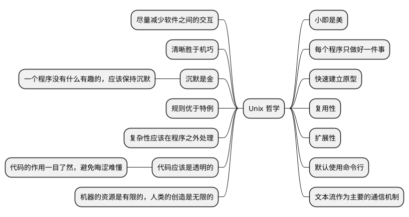

# Linux 历史和哲学

这些内容都已经流传的很久，现在从各处摘录集中在这篇文章中。虽然说是 Unix 哲学，也同样适用于 Linux，一部分也适用于 Windows。

这些内容是为了让我们更深入地理解 Unix、了解其背后地思想，以及作用于我们的编程中。如此说来，那是一笔宝贵的财富，需要我们继承起来。

## 历史 {id="history"}

Unix 这个词语，非计算机专业的人可能几乎没有听过，但是它一直在我们的身边，生活中，如春雨般润物细无声。我们用的各种服务，从点餐外卖到看书购物，这些程序的服务端几乎都安装在类 Unix 的服务器上，绝大部分是 Linux。

而 Linux 来自于 Minix,Minix 参照了 Unix。在维基百科 Unix 词条中，有一种图非常有助于我们理清楚 Unix 发展的脉络，直到自己身处何方，如下:

我们看到，Unix 举例我们越来越远，技术也日新月异。我们没有可能跟上技术发展的节奏，永远站在技术的最前沿。但是，精神一直在流传，其核心的思想几乎没有发生变化。这些反而是褪尽繁华之后，留下的最根本的东西。也是最值得我们学习的东西。所以，到现在，我们还在说 Unix、学 Unix、用 Unix。

当然，Unix 是面向开发者的。这是是它的一种信条：开放给开发者并且相信开发者能够开发出自己所希望的应用程序。所以，你可以删除一个文件，并且不会有 Window 中的回收站这样的东西。删除了就再也找不回来了。你可以删除所有的文件，不会有人阻止你使用 `rm -rf /` 这条命令。

## 从开源说起 {id="open-source"}

我们看到，Unix 举例我们越来越远，技术也日新月异。我们没有可能跟上技术发展的节奏，永远站在技术的最前沿。但是，精神一直在流传，其核心的思想几乎没有发生变化。这些反而是褪尽繁华之后，留下的最根本的东西。也是最值得我们学习的东西。所以，到现在，我们还在说 Unix、学 Unix、用 Unix。

当然，Unix 是面向开发者的。这是是它的一种信条：开放给开发者并且相信开发者能够开发出自己所希望的应用程序。所以，你可以删除一个文件，并且不会有 Window 中的回收站这样的东西。删除了就再也找不回来了。你可以删除所有的文件，不会有人阻止你使用 rm -rf / 这条命令。

## Unix 哲学

Unix 哲学指的是在构建 Unix 系统中使用的一些最佳实践，帮助开发者可以构建出简介、优雅、模块化的易于使用的软件。

这些条目是 Ken Thompson、Dennis Ritchie 和 Douglas McIlroy 等在贝尔实验室开发 Unix 系统时提出的。 Rob Pike 和其他 Unix 开发者进一步阐述，后来收录在了 《Unix 编程哲学》和《The Art of Unix Programming》两本书中。

这些法则在软件开发中一年一年的流传，在开发中一代一代的继承。

## Ubuntu 的传说

首先，Ubuntu 这个次来源于非洲南部祖鲁语或者豪萨语，意思是“人性”，“我的存在是因为大家的存在”， 是非洲的传统价值观之一， 也是南非共和国的建国价
值观之一。

Ubuntu 的正确发音如下:

