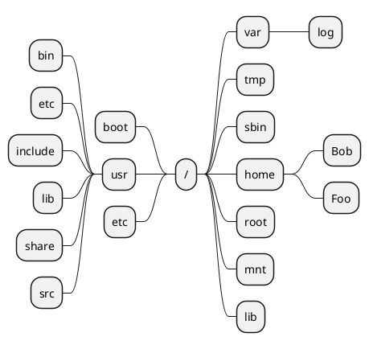

# 文件系统

这篇文章介绍 Linux 中的文件系统。

## 目录结构 {id="directory-structure"}

在 Windows 中，划分为不同的磁盘分区。如下图所示:


但是在 Linux 上，表现形式和 Windows 不太一样，没有 A盘、B盘、C盘的概念，有的只是单一目录树：



那么这么多的目录他们都是干什么用的呢？下面这张表格可以回答这个问题:

| 目录    | 功能                |
|-------|-------------------|
| bin   | 重要的可执行文件、shell 命令 |
| boot  | 引导器配置文件、内核等       |
| dev   | 设备文件              |
| etc   | 系统专有的配置文件         |
| lib   | 重要的共享库和内核模块       |
| media | 可移动设备挂载点          |
| mnt   | 其他文件系统的临时挂载点      |
| opt   | 附加应用软件包           |
| sbin  | 重要的系统可执行文件        |
| tmp   | 临时文件              |
| usr   | 文件系统的第三层          |
| var   | 可变数据              |

## /proc 目录介绍 {id="proc"}

在Linux系统中，`/proc` 目录是一个特殊的文件系统，称为 proc文件系统（procfs）。它不是存储在磁盘上的实际文件系统，而是一个虚拟文件系统，通常用于在内核和用户空间之间提供接口。其作用如下:

<code-block lang="mermaid">
mindmap
    proc目录作用
        记录进程信息
        记录系统信息
        内核配置参数
        动态控制文件
        调试信息
</code-block>

很多命令，其实现都依赖于`/proc` 目录中的数据，比如 `ps` 、`top` 、`free` 等。

### 磁盘的状态 {id="state"}

我们可以使用 `iostat` 命令来查看磁盘的状态:
```shell
# iostat -h
Linux 5.15.0-86-generic (tizi)  10/09/2024      _x86_64_        (48 CPU)

avg-cpu:  %user   %nice %system %iowait  %steal   %idle
           0.9%    0.0%    0.1%    0.2%    0.0%   98.6%

      tps    kB_read/s    kB_wrtn/s    kB_dscd/s    kB_read    kB_wrtn    kB_dscd Device
     3.19        11.7k        83.4k        59.9k      19.4G     137.8G      99.0G dm-0
     0.00         0.0k         0.0k         0.0k       4.5M       0.0k       0.0k loop0
     0.00         0.0k         0.0k         0.0k       3.9M       0.0k       0.0k loop1
     0.00         0.0k         0.0k         0.0k      29.5M       0.0k       0.0k loop2
     0.00         0.0k         0.0k         0.0k      22.3M       0.0k       0.0k loop3
     0.00         0.0k         0.0k         0.0k       4.1M       0.0k       0.0k loop4
     0.00         0.0k         0.0k         0.0k       2.5M       0.0k       0.0k loop5
     0.00         0.0k         0.0k         0.0k      39.1M       0.0k       0.0k loop6
     0.00         0.0k         0.0k         0.0k      10.0k       0.0k       0.0k loop7
     0.00         0.0k         0.0k         0.0k       1.5k       0.0k       0.0k sr0
     2.92        11.8k        83.7k        61.4k      19.5G     138.3G     101.4G vda
   107.61       170.0k         1.4M       880.1k     280.9G       2.3T       1.4T vdb
     1.55       260.8k       262.8k         3.5M     431.0G     434.3G       5.8T vdc
```
