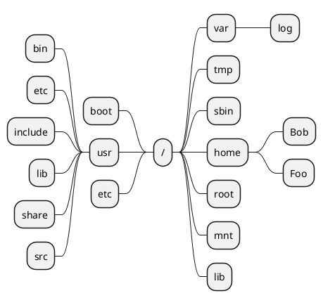

# 文件系统

这篇文章介绍 Linux 中的文件系统。

## 目录结构 {id="directory-structure"}

在 Windows 中，划分为不同的磁盘分区。如下图所示:

但是在 Linux 上，表现形式和 Windows 不太一样，没有 A盘、B盘、C盘的概念，有的只是单一目录树：

那么这么多的目录他们都是干什么用的呢？下面这张表格可以回答这个问题:

| 目录    | 功能                |
|-------|-------------------|
| bin   | 重要的可执行文件、shell 命令 |
| boot  | 引导器配置文件、内核等       |
| dev   | 设备文件              |
| etc   | 系统专有的配置文件         |
| lib   | 重要的共享库和内核模块       |
| media | 可移动设备挂载点          |
| mnt   | 其他文件系统的临时挂载点      |
| opt   | 附加应用软件包           |
| sbin  | 重要的系统可执行文件        |
| tmp   | 临时文件              |
| usr   | 文件系统的第三层          |
| var   | 可变数据              |

## /proc 目录介绍 {id="proc"}

在Linux系统中，`/proc` 目录是一个特殊的文件系统，称为 proc文件系统（procfs）。它不是存储在磁盘上的实际文件系统，而是一个虚拟文件系统，通常用于在内核和用户空间之间提供接口。其作用如下:

<code-block lang="mermaid">
mindmap
    proc目录作用
        记录进程信息
        记录系统信息
        内核配置参数
        动态控制文件
        调试信息
</code-block>

很多命令，其实现都依赖于`/proc` 目录中的数据，比如 `ps` 、`top` 、`free` 等。