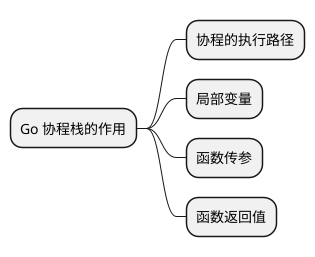
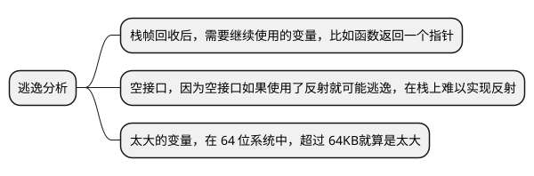
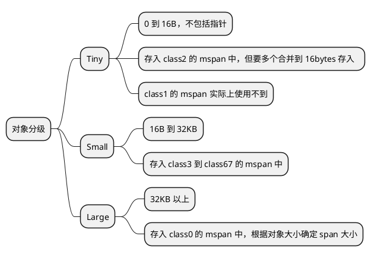

# Go 语言的内存模型

Go 是一门支持高并发的语言，其内存模型的设计也处处考虑了高并发的场景。这篇文档详细描述了 Go 语言的内存模型，包括栈内存和堆内存。

## Linux 进程的内存使用 {id="process-memory-usage-in-linux"}

在 Linux 中，为每一个进程都分配了 256TB 的虚拟内存，使用 Page 作为内存管理的基本单位，一般为 4KB。通过 4 级页表映射物理内存，因为 1 级页表过于占用空间，如果是 32 位操作系统就需要 4MB 的空间来映射，而且是每个进程 4MB，这实在是太大了。

但是上面这样的结构还是存在性能问题，因为 CPU 每次都需要通过 4 级页表去查真实的物理地址。于是，就有了上面这样的架构，在 CPU 维护了 TLB 缓存。

## Go 的栈在堆上 {id="heap-is-on-the-stack"}

Go 协程栈的作用如下:

在 C 或者 C++ 中，程序的堆区和栈区是分开的。而 Go 的协程栈位于堆内存上，这是为什么呢？

## 栈空间溢出怎么办 {id="stack-space-overflow"}

如果局部变量太大，或者栈帧太多，会导致栈空间溢出。如果是变量太大，会通过逃逸分析，将变量存储到堆上。如果是栈帧太多呢？通过栈扩容来解决。

### 逃逸分析 {id="escape-analysis"}

上文我们已经说了，Go 的栈是在堆上的，并且栈中还记录了局部变量、函数传参以及函数的返回值。那么如果栈空间不够用怎么办呢？Go 使用了逃逸分析，即将部分变量存放（“逃逸”）到堆上。那么什么情况如此呢？

### 栈扩容 {id="stack-expansion"}

Go 栈的初始空间为 2KB。在源码中通过 `morestack` 函数来判断栈空间是否足够，如果不够则需要扩容。在 Go v1.4 之前使用的是分段栈的方式，之后使用了连续栈的方式。

## Go 的堆内存结构 {id="heap-struct"}

以 64 位 Linux 为例，Go 的堆内存结构如下:

> 在 Go 的源码`mheap.go` 中可以看到 `mheap` 以及 `heapArena`对应的 struct。

heapArena 是 Go 内存管理的一个基本单位，一个 heapArena 是 64MB。每次向操作系统申请堆内存，或者释放堆内存，都是一个 heapArena。所以 Go 的堆内存就是由很多的 heapArena 组成的，最多可以有 220个（256 TB / 64 MB），当然因为实际物理空间只有 64GB，所以不可能申请那么多。

### HeapArena 的内存分配

那么 heapArena 是如何分配这 64MB 的内存空间的呢？一般有三种分配方式，分别是线性分配、链表分配以及分段分配。而 Go 采用的是分段分配。下图显示了线性分配:
如上示意图，线性分配就是按照顺序分配下去，我们看到 Object 和 Object 之间的 Free 是因为其间曾经存放有 Object，但是已经被当作垃圾回收了。那么线性分配对于这种情况是不管的，只管继续在剩余的空间中按照循序继续分配。可以看出，这种方式的缺点就是最造成巨大的空间浪费（那些被作为垃圾回收的空间），碎片化。

链表分配就是在线性分配的基础上，采用链表记录被 GC 回收的空间地址。如果继续写入 Object，首先会在链表中查询是否存在合适的空间存放，如果存在则利用 Free 的空间，如果不存在则在 Heap Arena 按循序继续开辟。这种方式比线性分配要好，但是依然会存在较多的空间浪费以及碎片化，因为不一定能找到合适大小的空间。

分级分配就是将 64MB 分成不同的级别（mSpan），每个级别划分成相同大小的块（Span）,然后 heapArena 就是由这样不同大小的 mSpan 组成。如果添加对象，则将对象按照大小放入不同层级的 Span 中。如果是删除对象，则将 Span 清空，之后可以重复使用。而如果一个对象大于上一个层级，又小于下一个层级，也只能放入下一个层级的 Span 中，多出来的空间就浪费了。但这种分级的方式最大程度的避免了空间浪费以及空间碎片化。

上面的只是示意图，Go 的实现是不同的，划分了 68 级，如下表所示：

| class  | bytes/obj | bytes/span | objects | tail waste | max waste | min align |
|--------|-----------|------------|---------|------------|-----------|-----------|
| 1      | 8         | 8192       | 1024    | 0          | 87.50%    | 8         |
| 2      | 16        | 8192       | 512     | 0          | 43.75%    | 16        |
| 3      | 24        | 8192       | 341     | 8          | 29.24%    | 8         |
| 4      | 32        | 8192       | 256     | 0          | 21.88%    | 32        |
| 5      | 48        | 8192       | 170     | 32         | 31.52%    | 16        |
| ...... | ......    | ......     | ......  | ......     | ......    | ......    |
| 67     | 32768     | 32768      | 1       | 0          | 12.50%    | 8192      |

> 这张表格来源于 Go 的源码文件 `sizeclasses.go` 。

### MCentral 中央索引

前面我们说了，我们的堆内存是由很多的 heapArena 组成的。每个 headArena 由划分为 68 级别的 mSpan，每个 mSpan 中又有相同空间大小的 span 组成。问题来了，如果我要新增一个数据，那么多的 heapArena，怎么找到合适的 span 存入呢？

Go 引入了中央索引，为这些 heapArena 创建中央索引。这样就不需要遍历每个 heapArena 了，去查询索引即可。Go 会创建 136 个 MCentral 的结构体，包含 68 个需要 GC 扫描的 mspan，68 个不需要 GC 扫描的 mspan。结构示意图如下:

mcentral 就是一个链表，每一个 class 对应两种，分为别需要 GC 扫描和不需要 GC 扫描的 mcentral 链表。比如一些常量数据就不需要 GC 扫描，而一些含有指针的数据就需要 GC 扫描。

但是这样设计还存在性能问题，所有的线程去操作这个 mcentral 的时候，需要通过使用 Mutex 互斥锁来保障线程安全。在高并发的场景下，锁冲突严重，就造成了严重的性能问题。为此，引入了线程本地缓存，在每个线程中加入 `mcache`，每个 `mcache` 中包含 136 个 `mspan`。如下示例图：

### 对象分级存储

在 Go 中，对象根据大小进行了分级，如下:

## 总结 {id="summary"}

Go 语言内存模型设计紧密围绕高并发场景，确保了在多线程环境下的高效稳定运行。文档详细介绍了 Go 的内存管理机制，包括栈内存和堆内存的使用。

Linux 进程内存使用中，每个进程拥有高达 256TB 的虚拟内存空间，以 4KB 的 Page 作为基本内存管理单元，并通过四级页表映射物理内存，为了解决 CPU
查找物理地址时的性能问题，引入了 TLB 缓存进行优化。

Go 语言的独特之处在于其协程栈位于堆上，不同于 C 或 C++ 中独立的堆栈区划分。这样设计的原因在于更好地支持协程的轻量级切换以及动态扩展的需求。当
栈空间因局部变量过大或栈帧过多导致溢出时，Go 采用逃逸分析技术，将部分变量移至堆上存储。此外，Go 会通过栈扩容来应对栈深度过大的情况，从 Go v1.4 开始采用连续栈的方式来简化这一过程。

Go 的堆内存结构在 64 位 Linux 系统下具有精细的设计。堆内存由多个 heapArena 组成，每个 heapArena 大小为 64MB，且最多可达 220个（受限于
实际物理内存）。heapArena 内部采用了分段分配的方式管理内存，而非简单的线性分配或链表分配，以最大程度地减少空间浪费和碎片化。Go 实现了 68 级别
的内存分级，每级包含相同大小的对象块（Span），并利用 MCentral 中央索引来快速定位合适的 Span 存储新数据。为了进一步提升并发环境下内存分配的性
能，Go 引入了线程本地缓存 mcache，避免频繁的互斥锁操作造成的性能瓶颈。

在对象存储方面，Go 对象根据大小被分为 Tiny、Small 和 Large 三级。Tiny 对象（0 到 16B，不含指针）合并存储，Small 对象（16B 到 32KB）按照
大小放入不同级别的 mspan，而 Large 对象则根据具体大小确定存放的 mspan 大小。这样的分级存储策略有助于实现高效的内存管理和垃圾回收。