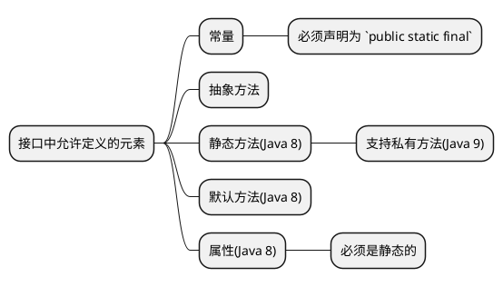

# 接口和抽象类

在 Java 编程语言中，接口（Interfaces）和抽象类（Abstract Classes）是两种基本的设计机制，它们在处理类的继承和多态性方面扮演着关键角色。

## 什么是接口 {id="interface"}

我们先来看接口在 Java 中是如何定义的吧:
```Java
public interface Vehicle {

    public static final int MAX_SPEED = 120;
    
    void startEngine();
    
    void stopEngine();
    
    default void honk() {
        System.out.println("Beep Beep!");
    }
    
    static void getType() {
        System.out.println("This is a vehicle.")
    }
}
```
上面的示例中，我们定义了一个名为 `Vehicle` 的接口，并定义了 `startEngine` 和 `stopEngine` 两个方法，但是没有实现。同时还定义了一个名为
`honk` 的方法，并且实现了它。



接口并不是软件独有的概念，在硬件领域也有接口。比如 “USB” 接口，就是一种硬件上的契约，各个厂商要采用 USB 接口就必须要实现
USB 的协议。

在 Java 中，实现接口就以为着要实现这个接口的全部方法。**所以，接口的本质就是一种“契约”**。比如我们下面这个示例就实现了上面示例中的接口中的所有的抽象方法:
```Java
public class Car implements Vehicle {

    @Override
    public void startEngine() {
        System.out.println("Starting the car engine...");
    }

    @Override
    public void stopEngine() {
        System.out.println("Stopping the car engine...");
    }

}
```
不需要重新定义 `default` 方法 `honk`，因为它已经在接口中有了默认实现。也不需要重新定义 `static` 方法 `getType` ，因为静态方法是通过接口
直接调用的。

## 抽象类 {id="abstract-class"}

**抽象类结合了普通的类和接口，可以理解成“普通的类 + 抽象方法 - 实例化”。** 抽象类和普通类的区别如下表所示:

| 属性/行为 | 普通类                      | 抽象类                                     |
|-------|--------------------------|-----------------------------------------|
| 实例化   | 可以直接实例化对象                | 不能直接实例化，必须通过其非抽象子类实例化                   |
| 方法定义  | 可以包含任何类型的方法（包括普通方法、静态方法） | 可以包含普通方法、静态方法以及**抽象方法**                 |
| 抽象方法  | 不包含抽象方法                  | 可以包含没有实现体的抽象方法，使用 `abstract` 关键字修饰      |
| 子类要求  | 子类可以选择性地重写父类方法           | 子类如果继承抽象类，必须提供抽象类中所有抽象方法的实现，除非子类本身也是抽象类 |
| 设计目的  | 通常用于创建可直接使用的具体实体         | 主要用于作为其他类的基类，定义通用接口或规范，强制子类遵循某些设计原则     |

下面的示例定义了一个名为 `Animal` 的抽象类:
```Java
public abstract class Animal {

    protected String name;

    public Animal(String name) {
        this.name = name;
    }

    public abstract void makeSound();

    public abstract void move();

    public void sleep() {
        System.out.println(this.name + " is sleeping.");
    }

    public void eat(String food) {
        System.out.println(this.name + " is eating " + food + ".");
    }
}
```

抽象类是采用继承而不是实现的，这点和接口不一样。但是，Java 只能单继承，而接口可以多实现。

## 接口还是抽象类 {id="interface-or-abstract-class"}

接口和抽象类的对比，如下表所示。
当然，抽象类与接口的对比可以通过以下表格来展示：

| 属性/行为  | 抽象类                                                | 接口                                                              |
|--------|----------------------------------------------------|-----------------------------------------------------------------|
| 关键字定义  | 使用 `abstract` 关键字定义                                | 使用 `interface` 关键字定义                                            |
| 实例化    | 不能直接实例化，必须通过非抽象子类实例化                               | 不能被实例化                                                          |
| 方法默认实现 | 可以包含抽象方法（无实现体），也可以包含具体方法（有实现体）                     | 自Java 8起可以包含具有默认实现的default方法，所有其他方法默认都是抽象的                      |
| 构造器    | 可以有构造器，但只能用于子类调用                                   | 不允许有任何构造器                                                       |
| 访问修饰符  | 抽象方法默认为 `public`，成员变量默认为 `protected`               | 所有方法默认为 `public abstract`，成员变量默认为 `public static final`（即编译时常量） |
| 多继承    | Java中一个类只能继承一个抽象类                                  | Java中一个类可以实现多个接口                                                |
| 设计目的   | 通常用于提供部分实现，并规定部分抽象方法让子类去实现                         | 主要用于定义一组行为规范或契约，完全抽象，不包含任何实现细节                                  |
| 状态保存   | 可以包含字段并拥有状态（尽管抽象类中的字段通常是 `protected` 或者 `final` 的） | 不包含字段，无法保存状态，只关注行为定义                                            |

以上表格概述了抽象类和接口在Java编程语言中的主要区别。根据应用场景的不同，开发者可以选择使用抽象类还是接口来实现代码的抽象和扩展性设计。
具体采用抽象类还是接口，根据实际情况而定。抽象类更着重于“契约 + 代码复用”，而接口则着重于“契约”。

所以在实际的编程中，我的经验法则是**先使用接口，当发现有逻辑需要复用的时候，再重构成抽象类。而不会一开始就使用抽象类，除非一开始就明确需要逻辑上
的复用**。这样做的好处如下:

* **支持多重实现**: 使用接口允许类实现多个接口，从而获得更多的灵活性。而抽象类限制了这种灵活性。

* **逐步细化**: 开始时使用接口可以保持设计的简单行和清晰性。随着项目的进展和需求的变化，如果发现有共同的功能需要在多个类中实现，那么重构为抽象类是
  一种自然的演进。这样可以确保仅在必须的时候引入更复杂的类层次结构。

* **遵守 SOLID 原则**: 特别是接口隔离原则（Interface Segregation Principle）和依赖倒置原则（Dependency Inversion Principle），使用
  接口可以更好地遵循这些原则，提高代码质量。

* **后期灵活的重构**: 如果你的设计开始就使用接口，那么后期可以将接口的实现更换为抽象类的实现，会更加容易和灵活。

这种方法体现了一种渐进和响应式的设计策略，先满足当前需求，随着系统的发展和需求的变化进行适当的调整和重构。这种方式既可以保证当前设计的简洁性又
能够在之后需求发生变化后提供足够的灵活性。

## 总结 {id="summary"}

本文介绍了 Java 编程语言中接口和抽象类的概念及其在处理类继承和多态性方面的重要作用。

接口是一种定义行为规范或契约的机制，它只包含抽象方法、默认方法、静态方法和常量。接口的本质是“契约”，实现接口的类必须提供接口中所有抽象方法的实现。

而抽象类结合了普通类和接口的特点，可以包含抽象方法以及具体实现的方法，并且不能直接实例化，必须通过其非抽象子类实例化。

接口与抽象类的主要区别在于：接口强调纯粹的行为规范，不包含状态信息且支持多实现；抽象类则允许部分实现代码复用，包含字段并可拥有状态，但Java中一个
类只能继承一个抽象类。设计时，开发者通常先采用接口以保持设计简单清晰，随着需求变化再根据需要重构为抽象类以实现逻辑复用。同时，使用接口能更好地
遵循 SOLID 原则，提供更灵活的设计策略和后期重构空间。