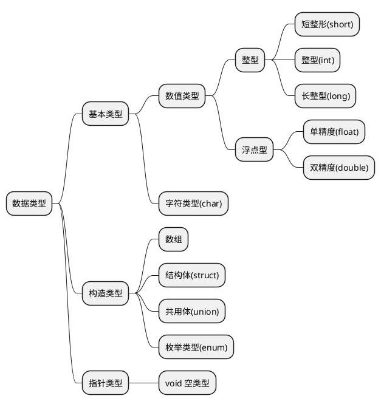

# 变量

这一篇文档我们来介绍 C 语言中的数据变量和变量类型，比如说数值类型、字符/字符串类型等。

## 变量和常量 {id="variables-and-const"}

在 C 语言中，定义变量的语法如下:
```
type variable_name;				// example: int number;
type variable_name = initialized_value; 	// example: int number = 0;
```
定义常量有三种形式，第一种是使用 `const` 关键字:
```c
const int colorBlack = 0x000000;
printf("%#x\n", colorBlack);
```
但是这种方式其实是可以更改的, 使用指针:
```c
intptr_t *number = (intptr_t *) &colorBlack;
*number = 0xFFFFFF;
// Output: number: 0x62f314 colorRead: 0xffffff;
printf("number: %#x\tcolorBlack: %#x\n", number, colorBlack);
```
第二种定义常量的形式是使用宏(Macro)定义，在编译阶段就会替换指定的值,所以是不能变更的:
```c
#define COLOR_LIGHTPINK 0xFFB6C1
int main() {
 	printf("Macro color: %#x\n", COLOR_LIGHTPINK);   
}
```
第三种形式就是字面量，就是写死在代码中的值, 并不建议这么做:
```c
printf("DarkGreen: %#x\n", 0x006400);
```

> 注意: 在 C 语言中，都要对变量进行初始化赋值。否则变量初始化值是不确定的。

## 数据类型 {id="variable-value-types"}



### 整型 {id="integer"}

说的是整型而不是整形哈，我们开始吧。C 语言特别注重的是性能，内存也是自己管理的。所以，相比其他的语言，就数值类型而言也多定义了几种范围，使得开发者有更多选择的余地，选择最小范围的数据类型以节省内存空间。如下列表中共有 4 种:

| short | int | long | long long |
|-------|-----|------|-----------|

C 语言对于这些类型都有着宽泛的定义，比如说 short 规定了它不能小于 16bit。各家的编译器实现起来也各不相同。想要查看这些类型具体的占用字节数，可以使用下面的语句:
```c
printf("short int: %llu\n", sizeof(short int));
printf("short int: %llu\n", sizeof(int));
printf("short int: %llu\n", sizeof(long int));
printf("short int: %llu\n", sizeof(long long int));
```
> 注意: sizeof 不是一个函数，而是一个运算符，返回的是 size_t 的类型。

每一种类型范围都不同，使用如下语句可以打印其最大值和最小值:
```c
#include <limits.h>

printf("int max: %d\t int min: %d\n", INT_MAX, INT_MIN);
printf("int max: %lld\t int min: %ld\n", LLONG_MAX, LONG_MIN);
printf("long long int max: %lld\t long long int min: %lld\n",LONG_LONG_MAX,LONG_LONG_MIN);
printf("short int max: %d\t short int min: %d\n", SHRT_MAX,SHRT_MIN);
```
上面所说的都是有符号类型，那么无符号类型呢？在类型的前面加上关键字 `unsigned` ，如下表所示:

| unsigned short | unsigned int | unsigned long | unsigned long long |
| --- | --- | --- | --- |

打印无符号类型的最大值:
```c
#include <limits.h>

printf("unsigned short max: %du\n", USHRT_MAX);
```

### 浮点类型 {id="float"}

浮点类型的数据，使用 `float` 关键字定义, 如下示例:
```c
float a = 0.3f;		// 需要在末尾加上 f, 否则作为双进度类型处理
float b = 0.6f;
printf("%f\n", a + b);
printf("%llu\n", sizeof(float));	// Output: 4
```

### 字符类型 {id="char"}

在计算机中，字符也都是使用数字来表示的，我们称之为字符编码。比如在 ASCII 编码中，字母 `a` 使用 97 来表示，而字符 `0` 呢？使用 48 来表示:
```c
char a = 'a';
char b = '0';
printf("%c - %d\n", a, a);		// Output: a - 97
printf("%c - %d\n", b, b);		// Output: b - 48
```
反过来也是一样的道理:
```c
char a = 97;
printf("%c\n", a);		// Output: a
```
像上面这样采用 `\` 开头的称之为转义字符，其中 `\n` 表示换行符，在 ASCII 码中属于不可见字符(在屏幕上并不显示实际字符，而是有特殊含义的)。我们也可以使用转移的八进制或者十六进制来表示字符:
```c
char a = 97;
char a_escape_oct = '\141';		// 八进制
char a_escape_hex = '\x61';		// 十六进制
printf("%c\t%c\t%c\n", a, a_escape_oct, a_escape_hex);	// \t 表示水平制表符
```
上面演示的都是 ASCII 中的字符，使用一个字节来存储，所以总共只能表示 256 个字符(Extended ASCII, 延伸美国标准信息交换码)。那如果是中文呢？在 C95 标准中，可以使用 `L<'unicode char>'` 来表示这类的 Unicode 字符, 中文就包含其中:
```c
wchar_t chinese = u'中';			// typedef unsigned short wchar_t;
printf('%x\n', chinese);		// 4e2d 这是"中"在 Unicode 中的 Code Point
```

### 格式化符 {id="format"}

当我们使用 `printf` 函数打印的时候，不同的数据类型对应的不同的格式化符，如下表所示:

| 数据类型            | 有符号格式化符 | 无符号格式化符 |
|-----------------|---------|---------|
| short/int       | %d      | %du     |
| long            | %ld     | %lu     |
| long long       | %lld    | %llu    |
| char            | %c      |         |
| char[] / string | %s      |         |
| 十六进制数           | %x      |         |
| 八进制             | %o      |         |

> 更多的内容请查看：[《scanf, fscanf, sscanf, scanf_s, fscanf_s, sscanf_s》](https://zh.cppreference.com/w/c/io/fscanf)

## 变量类型 {id="variable-types"}

我们常说的变量类型有整型、字符型，其实说的是变量的值类型。在 C 语言中，变量本身也是有类型的，如下:

* 自动类型(Automatic Types)
* 静态类型(Static Types)
* 寄存器类型(Register Types)

### 自动类型 {id="automatic-type"}

如果没有特殊的声明，我们定义的变量就称之为自动类型的变量。如下:
```C
int num = 0;
// 等同于如下形式
auto int num = 0;
```
那么什么是自动变量呢？自动变量也就是我们常说的局部变量(Local Variable)。在 C 语言中，局部变量会在进入块作用域时申请内存并在离开块作用域之后销毁申请的内存。也就是说，局部变量的生命周期值只存在于块作用域。

### 静态类型 {id="static-type"}

所谓的静态类型，从语法上来说，是将变量声明为 `static` 。如下:
```C
static int num = 0;
```
那么静态类型和自动类型有什么区别呢？或者说什么是静态类型呢？我们通过一个例子来观察一番:
```C
void sum(void) {
    static num;
    num++;
    printf("num : %d\n", num);
}
int main(int argc, char **argv){
    sum();		// Output: num : 1
    sum();		// Output: num : 2
    sum();		// Output: num : 3
}
```

上面的示例中，我们定义了一个函数 `sum` 。在这个函数中，我们将一个名为 `num` 的变量声明为 `static` 。在每次调用的时候，对其值递增处理。运行这个函数, 确实实现了 `num` 的值递增，并不会因为函数的退出而销毁其在内存中的空间。

### 寄存器类型 {id="register-type"}

汇编语言会被说成是面向寄存器编程，在 C 语言中，使用 register 关键字来修饰变量，让变量保存在寄存器中而不是内存中，以加快程序的执行速度。
```C
register int num;
```

在实际的编程中，并不建议使用寄存器变量，编译器会帮助我们去选择的。

## 变量作用域 {id="variable-scope"}

如果的变量是局部变量，那么代码就会具有块级作用域。块级作用域有以下几种:

* 文件级别作用域: 在函数以外的地方声明变量，或者使用 `static` 修饰变量
* 函数级别作用域：在函数中声明变量
* 使用 `{}` 块中定义变量
* 原型作用域：在函数的原型中使用变量

关于原型作用域，举例说明如下:
```C
void sum(int size, const int nums[size]) {
    int sum = 0;
    for(;size >= 0;size--) {
       sum += nums[size];
    }
    printf("Sum : %d\n", sum);
}
```

在这个函数中，我们求取传入的指定大小的数组的和，就使用了函数原型作用域。测试代码如下:
```C
int main() {
 	int nums[10] = {0, 1, 2, 3, 4, 5, 6, 7, 8, 9};
    sum(10, nums);
}
```

## 总结 {id="summary"}

这篇文档介绍了C语言中的数据变量和变量类型，涵盖了变量和常量的定义、数据类型、变量类型以及变量作用域等方面。

1. **变量和常量:**
    - 定义变量的语法，包括无初始化和有初始化的形式。
    - 介绍了常量的三种定义方式：使用`const`关键字，使用宏定义，在代码中直接写入字面量。

2. **数据类型:**
    - 列举了C语言中的基础数据类型，包括整型、浮点型、字符型。
    - 通过表格展示了整型的不同范围和大小，并演示了如何使用`sizeof`和`limits.h`库来获取数据类型的字节数和范围。
    - 演示了浮点类型的定义和使用。
    - 介绍了字符类型的表示、转义字符的使用以及Unicode字符的处理。

3. **格式化符:**
    - 给出了不同数据类型对应的有符号和无符号格式化符，以及用于打印十六进制和八进制数的格式化符。
    - 提供了一个链接，指向更多与格式化符相关的内容。

4. **变量类型:**
    - 详细讨论了变量的类型，包括自动类型、静态类型和寄存器类型。
    - 通过示例展示了`static`关键字和`register`关键字的使用。

5. **变量作用域:**
    - 解释了变量的作用域，包括文件级别作用域、函数级别作用域、块级作用域和原型作用域。
    - 通过一个求和函数的例子演示了原型作用域的概念。
